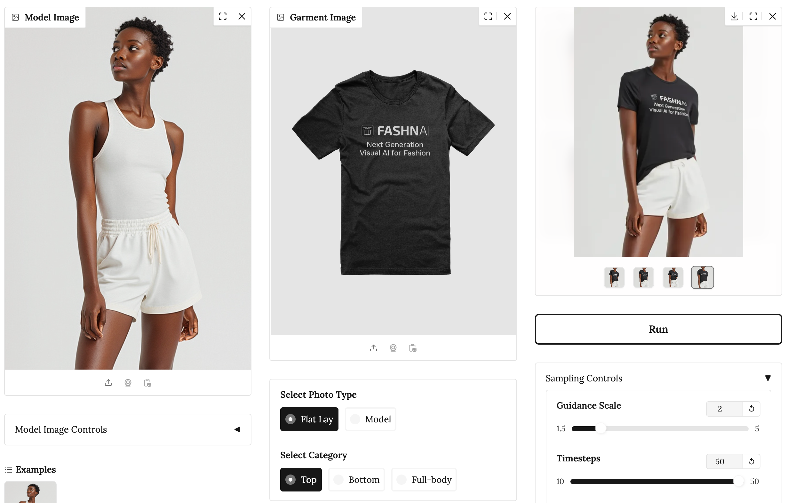

# Simple Virtual Try-On App using FASHN AI & Gradio

This repository implements a simple virtual try-on app that uses the Gradio framework and the FASHN API as its backend.

<p align="center">
    
</p>

### Sign Up to FASHN
This repository requires an API key from a FASHN account.
Don't have an account yet? [Create an account](https://app.fashn.ai/).

If you already have an account, go to Settings → API → `+ Create new API key`

### Setup

1. Clone this repository:
```bash
git clone https://github.com/fashn-AI/tryon-gradio-app
cd tryon-gradio-app
```

2. Install the required packages:
```bash
pip install -r requirements.txt
```

### Usage

1. Set the environment variable `FASHN_API_KEY` to the API key you created on the FASHN platform.
```bash
export FASHN_API_KEY="your-api-key"
```
2. Run the app:
```bash
python app.py
```

3. Open your browser and go to `http://localhost:7860/` to see the app in action.

If you wish to deploy the app or share it with others, you can use the `share` function in Gradio to generate a public link.
More on this can be found in the [Gradio documentation](https://gradio.app/docs).

### Helpful Guides and Documentation

To get the most out of the FASHN API, we recommend to read the following guides to better understand all node features and parameters:
1. [FASHN Features Guide: Part I (Model & Garment Controls)](https://fashn.ai/blog/getting-the-best-virtual-try-on-results-part-i)
2. [FASHN Features Guide: Part II (Sampling Controls)](https://fashn.ai/blog/getting-the-best-virtual-try-on-results-part-ii)

You can also review the official [API Docs](https://docs.fashn.ai/) for a concise summary of each of the parameters function and usage.


